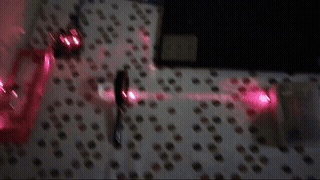
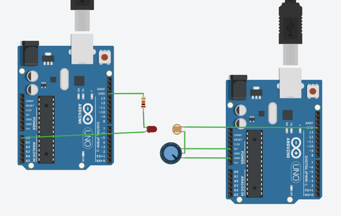
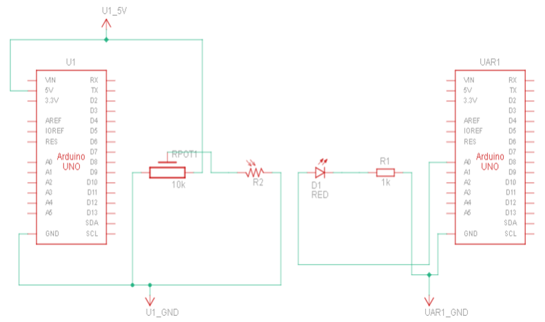
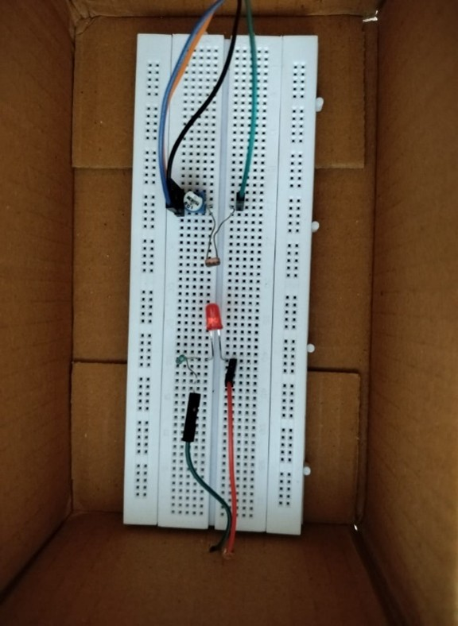
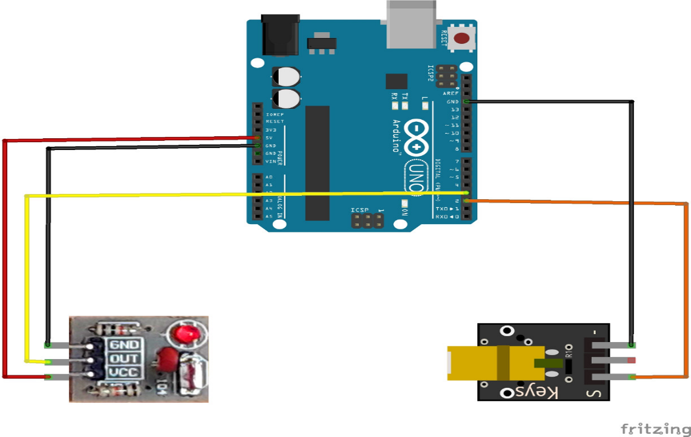
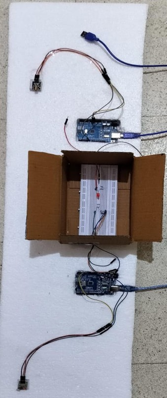

# Li-Fi (VLC) — Wireless Optical Communication over Laser

**RV College of Engineering | Experiential Learning, Theme: Quantum Mechanics | ACY 2023-24**

A prototype visible-light-communication (VLC) system that transmits text and images wirelessly using nothing but a modulated laser diode and a light sensor — no radio spectrum involved. Built and iterated across two hardware generations: an LED-based prototype, then a laser-based upgrade once the LED module's data rate proved to be the bottleneck.



*Live laser link between transmitter (left) and receiver (right) — beam visible due to ambient dust/reflection*

---

## Overview

Li-Fi (Light Fidelity) transmits data by rapidly toggling a light source and reading the resulting pulses with a photodetector, instead of using radio waves. The appeal is straightforward: it's immune to RF interference, works in RF-restricted environments, and piggybacks on lighting infrastructure that's already there.

This project builds a complete send-to-receive pipeline:

1. **Encode** — an image is converted to a base64 text string in Python
2. **Transmit** — an Arduino flickers a light source on/off to send that string bit by bit
3. **Receive** — a second Arduino reads the light pulses via a sensor and reconstructs the string
4. **Decode** — a Python script converts the received base64 string back into the original image

Two hardware generations were built to get here: an LED module first, then a laser module once the LED's data rate proved insufficient.

---

## Prototype 1 — LED Module

### Components

| Component | Role |
|---|---|
| Arduino UNO (x2) | Encodes outgoing bytes into on/off pulses (TX side); decodes incoming pulses back into bytes (RX side) |
| LED + 220Ω resistor | Light transmitter — flickers according to the binary code being sent |
| LDR (light-dependent resistor) | Light receiver — resistance drops when it detects the LED's light, output read as 0–5V |
| 10kΩ potentiometer | Tunes the LDR's output threshold so a genuine light pulse is reliably distinguished from ambient light |

The receiver takes an initial "no light" LDR reading as a baseline threshold; when the LED pulses on, the reading drops below that threshold and the bit is registered.



*Fritzing wiring diagram — LED transmitter (left Arduino) and LDR receiver with tuning potentiometer (right Arduino)*



*Schematic view of the same circuit*



*Prototype 1 breadboard, housed in a cardboard box to shield the LDR from ambient light*

**Result:** the LED module worked, but couldn't hit the data-transfer speed the team was targeting — this is what motivated the move to a laser-based link.

---

## Final Prototype — Laser Module

### Components

**KY-008 laser transmitter + receiver pair.** The KY-008 receiver is sensitive specifically to light in the 650–680nm band (red), and can register sharp wavelength/intensity changes — which makes it far better suited to fast data transfer over longer range than the plain LED+LDR setup. The transmitter side can flicker reliably at rates down to ~1ms.



*Fritzing wiring diagram — KY-008 laser transmitter and receiver modules*



*Final build: transmitter Arduino (top) and receiver Arduino (bottom), with the KY-008 pair inside the light-shielded box*

### Bit transmission logic

Both transmitter sketches follow the same core structure — send a LOW/HIGH framing pulse around each byte, then clock out 8 bits by toggling the light source per bit:

```cpp
void send_byte(char my_byte)
{
  digitalWrite(led, LOW);
  delay(period);

  for (int i = 0; i < 8; i++)
  {
    digitalWrite(led, (my_byte & (0x01 << i)) != 0);
    delay(period);
  }

  digitalWrite(led, HIGH);
  delay(period);
}
```

The receiver polls the sensor, and on each falling edge (light → dark) reconstructs a byte bit-by-bit at the same period, then prints the decoded character to serial. Full sketches: [`arduino-code/`](arduino-code/).

The jump from LED to laser is mostly a change in `period` — from 100ms/bit on the LED module down to 1ms/bit on the laser module — enabled by the KY-008's faster response time.

---

## Image Transfer Pipeline

Once reliable high-speed text transfer was working, the same link was reused to move images by treating an image as a base64-encoded text string:

1. **`image_to_base64.py`** reads an image file in binary mode and encodes it to a base64 string using Python's `base64` library
2. That string is fed into the laser transmitter's payload and sent using the same bit-by-bit protocol as any other text
3. The receiver Arduino prints the reconstructed base64 string to serial
4. **`base64_to_image.py`** decodes that string back into raw bytes and writes it out as an image file, closing the loop

Full scripts: [`python-code/`](python-code/).

---

## Results

| Metric | Value |
|---|---|
| LED module — text transfer | Functional, but below target speed |
| Laser module — flicker rate | ~1000 Hz experimental |
| Laser module — image transfer | 360×360px image in ~5 seconds |
| Laser module — text transfer | Any string within ~2 seconds |
| Per-bit period (laser) | ~1 ms |

**Constraint:** transmitter and receiver need to be in direct line-of-sight — a fundamental limitation of free-space VLC rather than something fixable in software.

---

## Challenges & Future Improvements

The main bottleneck throughout was the ~1ms/bit ceiling imposed by the Arduino UNO + KY-008 combination. Documented next steps to push past it:

- **Faster microcontroller / dedicated laser driver** — offload PWM timing from a general-purpose Arduino loop to hardware built for it
- **More sensitive receivers** — avalanche photodiodes (APDs) or photomultiplier tubes (PMTs) could unlock µs–ns range detection, at the cost of higher price and more delicate operating conditions
- **Manchester encoding** — squeeze more reliability and throughput out of the existing 1ms hardware ceiling by encoding more information per transition

---

## Tools & Methods

`Arduino UNO` `KY-008 Laser Transceiver Module` `LDR` `Python (base64)` `Fritzing` `KiCad`

---

## Team

Built as part of RV College of Engineering's Experiential Learning program (Theme: Quantum Mechanics, ACY 2023–24), by a 4-person team spanning AIML and Aerospace Engineering. Full project report available on request.
